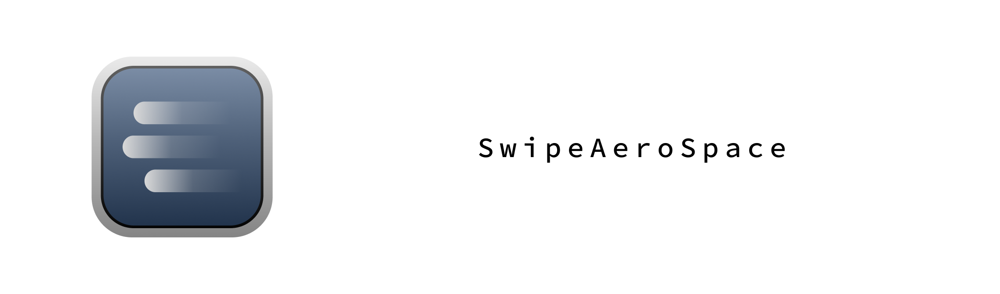

# About

Swipe with three fingers to change AeroSpace workspaces. This can be a single purpose alternative to Better Touch Tool.

# Installation

You can either download the pre-built binary (built with github actions) or build it from source.

## Download pre-built binary

1. Download the latest `SwipeAeroSpace.zip` from [Releases](https://github.com/MediosZ/SwipeAeroSpace/releases) page.
2. Unzip the archive and move `SwipeAeroSpace.app` into the Applications folder.
3. The app is ad-hoc signed so when you run the app macOS will warn you: "SwipeAeroSpace" can’t be opened because Apple cannot check it for malicious software. Right-click the app and click Open, a pop-up will appear, click Open again.
4. If the app still won't open, you need to goto `System Settings > Privacy & Security > Security` and select `Open Anyway`.
5. The app needs access to global trackpad events. Allow `SwipeAeroSpace` to control your computer in `System Settings > Privacy & Security > Accessibility`.

## Build from source 

First install Xcode, then there are two options:

- Open `SwipeAeroSpace.xcodeproj` to build the project and export the app.
- Or you can use `xcodebuild` directly to build and export the app.

# Usage 

After properly installation, you can use the 3-finger swipe to switch between AeroSpace workspaces.

# License

This project is licensed under the MIT License - see the LICENSE file for details.

# Acknowledgement

Big thanks to [Touch-Tab](https://github.com/ris58h/Touch-Tab).

